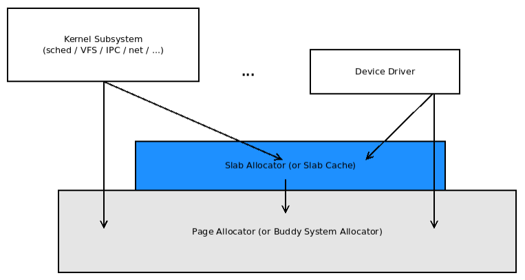
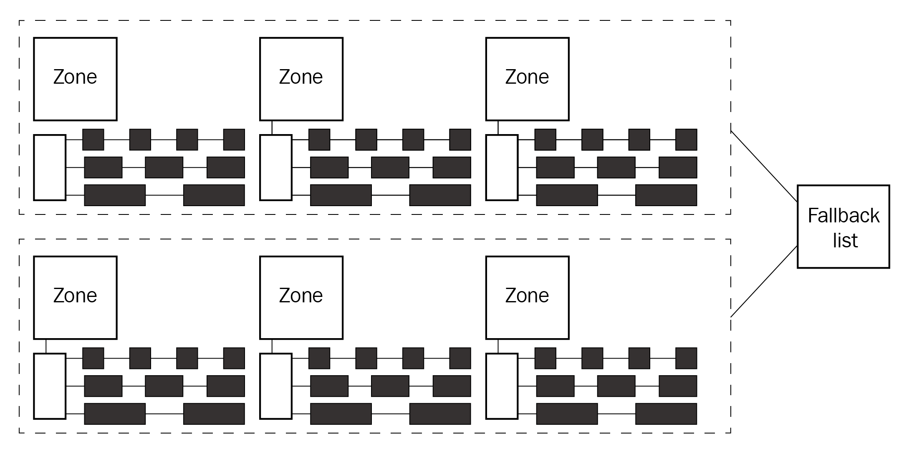
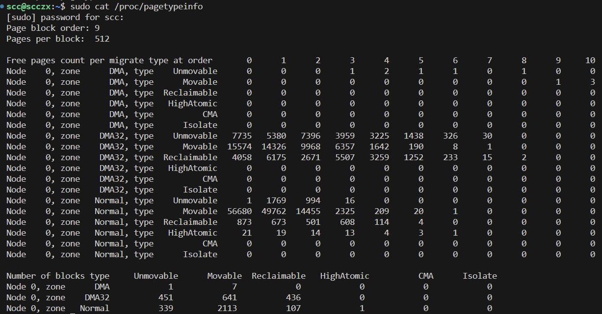
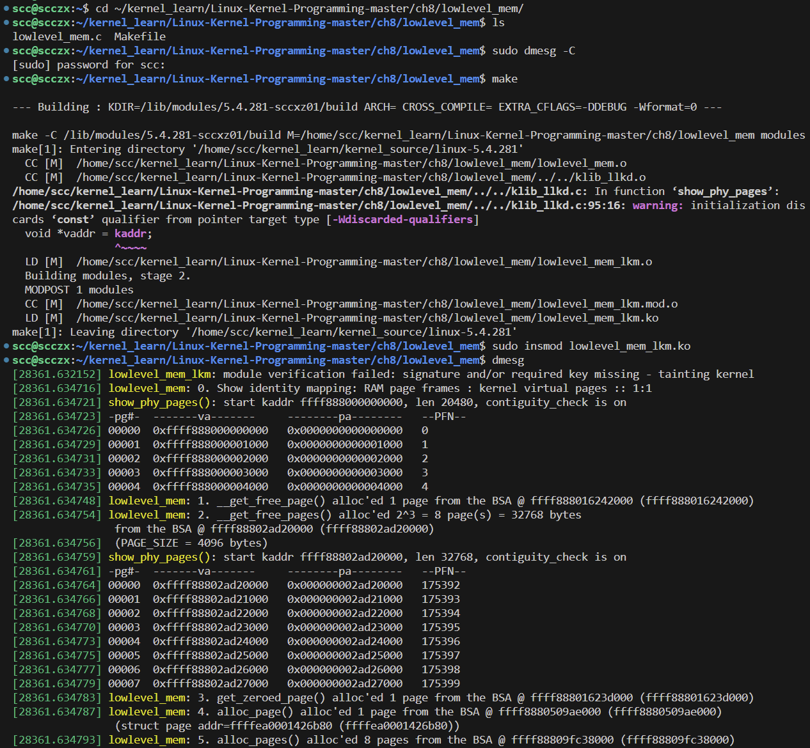
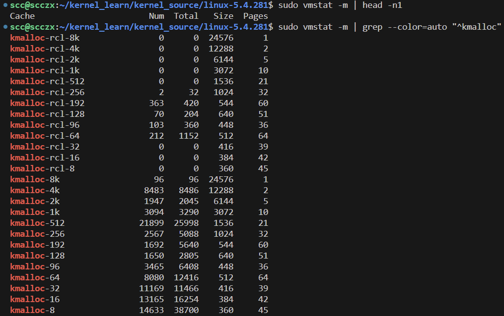
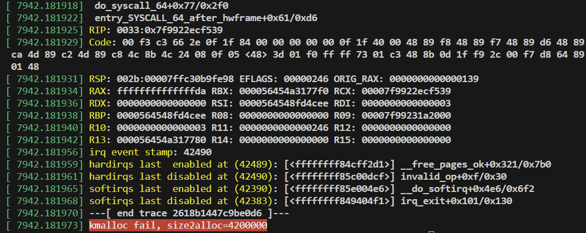
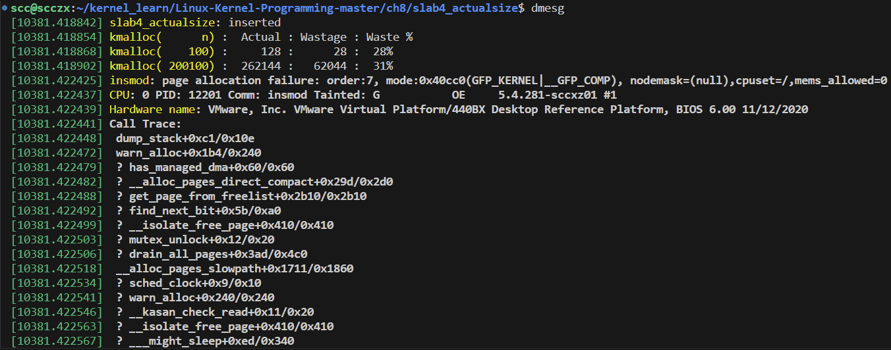
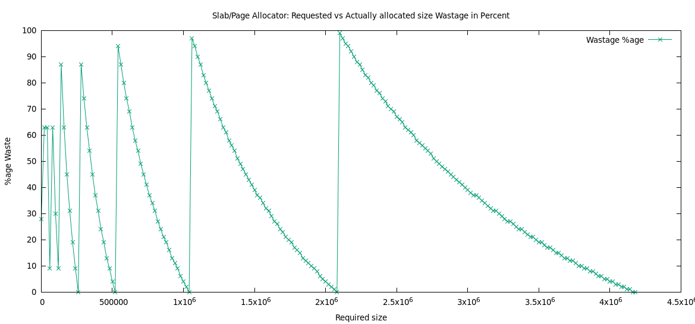

# Chapter 8 Kernel Memory Allocation for Module Authors - Part 1

在前两章中，我们讨论了内核内部结构及架构，以及内存管理的基本原理，这些内容为本章和下一章的学习奠定了必要的基础。在本章和接下来的章节中，我们将深入探讨各种方法下内核内存的实际分配与释放。我们会通过可以测试和调整的内核模块来演示这些方法，详细阐述其中的原因和原理，并提供许多实际应用中的技巧和窍门，以帮助内核或驱动程序开发者在内核模块中更高效地管理内存。

本章将介绍内核的两个主要内存分配器：页分配器（Page Allocator, PA，又称伙伴系统分配器 Buddy System Allocator, BSA）和 Slab 分配器。我们将深入探讨如何在内核模块中使用这些分配器的 API。事实上，我们不仅仅展示如何使用这些 API，还将清晰地说明为什么在某些情况下这些 API 并不总是最佳选择，以及如何在这些情况下进行优化。

在 Chapter 9 中，我们将继续深入研究内核内存分配器，探讨一些更高级的主题。

**本章将涵盖以下主题：**

- 介绍内核内存分配器
- 理解并使用内核页分配器（或 BSA）
- 理解并使用内核 Slab 分配器
- `kmalloc` API 的大小限制
- Slab 分配器的更多细节
- 使用 Slab 分配器时的注意事项

## **介绍内核内存分配器**

与任何其他操作系统一样，Linux 内核需要一个强大的算法和实现来执行一个非常关键的任务：分配和随后的释放内存或页帧（RAM）。Linux OS 中的主要分配（和释放）引擎被称为**页分配器（Page Allocator，简称 PA）或伙伴系统分配器（Buddy System Allocator，简称 BSA）**。其内部使用了一种所谓的伙伴系统算法来有效地组织和分配系统 RAM 中的空闲块。关于这个算法的更多内容，我们将在 “理解并使用内核页分配器（或 BSA）” 部分中进一步探讨。

当然，页分配器并不完美，因此它并不是获取和释放系统内存的唯一或总是最佳的方式。在 Linux 内核中还存在其他技术来完成这个任务，其中最重要的就是内核的 **Slab 分配器或 Slab 缓存系统**（我们使用 "slab" 作为这种分配器的通用名称，因为它最早是以这个名字出现的；不过实际上，**Linux 内核使用的现代 slab 分配器的内部实现被称为 SLUB（无队列 slab 分配器）**）。

可以这样理解：slab 分配器解决了一些问题，并对页分配器的性能进行了优化。到底是什么问题呢？我们很快就会看到。不过，现在需要理解的是，**实际分配（和释放）物理内存的唯一方法是通过页分配器。页分配器是 Linux OS 中内存分配（和释放）的主要引擎。**

因此，slab 分配器是基于（或层叠在）页分配器之上的。各种核心内核子系统以及内核中的非核心代码（如设备驱动程序）可以直接通过页分配器或间接通过 slab 分配器进行内存的分配（和释放）；以下图表对此进行了说明：



<center>[图 8.1]</center>

初期需要明确的几点：

1. **整个 Linux 内核及其所有核心组件和子系统（不包括内存管理子系统本身）最终都使用页分配器（或 BSA）进行内存的分配（和释放）**。这包括内核模块和设备驱动等非核心部分。

2. 上述系统完全驻留在内核（虚拟）地址空间中，无法从用户空间直接访问。

3. 页分配器从中获取内存的页帧**（**RAM**）** 位于内核低内存区域，或内核段的直接映射 RAM 区域（我们在上一章中详细介绍了内核段）。

4. **Slab 分配器最终是页分配器的用户，因此它的内存也来自于页分配器**（这也意味着来自内核低内存区域）。

5. 用户空间动态内存分配（通过熟悉的 `malloc` 系列 API）并不直接映射到上述层次结构（即，在用户空间中调用 `malloc()` 并不会直接导致调用页或 slab 分配器），这种映射是间接完成的。

6. 需要明确的是，Linux 内核内存是不可交换的。它永远不会被交换到磁盘上；这是在 Linux 早期就决定的，以保持高性能。而用户空间内存页面默认是可以交换的；系统程序员可以通过 `mlock()`/`mlockall()` 系统调用来更改这一行为。

## 理解和使用内核页分配器（或 BSA）

我们将学习 Linux 内核的主要内存分配（和释放）引擎的两个方面：

1. 首先，我们将介绍这个软件背后的基本算法（称为伙伴系统）。
2. 接着，我们将讲解它向内核或驱动程序开发者公开的 API 的实际和实用用法。

### 页分配器的基本工作原理 

我们将这一部分的讨论分成几个相关的部分。首先，从内核的页分配器如何通过其空闲列表（freelist）数据结构跟踪空闲物理页帧开始讲解。

#### 空闲列表组织

页分配器（伙伴系统）的算法核心在于其主要的内部元数据结构，称为伙伴系统空闲列表（freelist）。该列表由指向双向循环链表的指针数组组成，这个指针数组的索引被称为列表的“阶”（order）：表示将 2 提升到的幂。数组的长度范围从 0 到 `MAX_ORDER-1`。`MAX_ORDER` 的值取决于具体的架构。在 x86 和 ARM 架构上，这个值为 11，而在类似 Itanium 这样的大型系统上，这个值为 17。因此，在 x86 和 ARM 上，阶数范围是从 2^0 到 2^10，也就是从 1 到 1024。这意味着什么呢？

每个双向循环链表指向物理上连续的空闲页帧，这些页帧的大小为 2^order。例如（假设页大小为 4 KB），我们可以得到以下链表：

- 2^0 = 1 页 = 4 KB chunks
- 2^1 = 2 页 = 8 KB chunks
- 2^2 = 4 页 = 16 KB chunks
- 2^3 = 8 页 = 32 KB chunks
- 2^10 = 1024 页 = 1024 * 4 KB = 4 MB chunks

以下图示是页分配器空闲列表（单个实例）的简化概念示意图：

<a id="figure8-2"></a>


<center>[图 8.2]</center>

在上图中，每个内存 “chunk” 由一个方框表示（为了简单起见，图中的方框大小相同）。当然，**这些方框内部并不是真正的内存页面，而是表示指向物理内存帧的元数据结构（`struct page`）**。图的右侧显示了可以在左侧列表中排队的每个物理连续空闲内存块的大小。

内核通过 `proc` 文件系统为我们提供了一个方便的（摘要）视图，来查看页分配器的当前状态：

```c
cat /proc/buddyinfo
```


<center>[图 8.3]</center>

我们的虚拟机是一个伪 NUMA 系统，具有一个节点（节点 0）和两个区域（DMA、DMA32 和 Normal）。`zone XXX` 后面的数字表示在 阶 0、阶 1、阶 2 一直到 `MAX_ORDER-1`（此处为 11 - 1 = 10）中空闲（物理上连续的）页帧的数量。让我们从上面的输出中举几个例子：

- 在节点 0，DMA 区的阶 0 列表中有 0 个单页的空闲内存块。
- 在节点 0，DMA32 区的阶 3 中，数字为 15840；现在，取 2^order = 2^3 = 8 个页帧 = 32 KB（假设页面大小为 4 KB）；这意味着在该列表中有 15840 个 32 KB 的物理连续空闲内存块。

需要注意的是，**每个块本身都是物理上连续的 RAM**。另外请注意，给定阶上的内存块大小总是前一个阶的两倍（也是下一个阶的一半）。这是因为它们都是 2 的幂。

另一个重要点是：内核为系统中的每个节点和区域分别维护了多个 BSA 空闲列表，这种设计为 NUMA 系统上的内存分配提供了自然的支持。

下图展示了内核如何在系统的每个节点和区域上实例化多个空闲列表（图示来源：《Professional Linux Kernel Architecture》，Mauerer，Wrox 出版社，2008 年 10 月）：



<center>[图 8.4]</center>

正 [图 7-18 ](#figure7-18)所示，当内核调用页分配器分配 RAM 时，它会优先选择与发出内存请求的线程所在节点相关联的空闲列表（回顾一下上一章介绍的 NUMA 架构）。如果该节点的内存不足或无法分配内存，内核将使用一个回退机制，尝试从其他空闲列表中分配内存。（实际上，内存分配的过程更为复杂；我们将在 “页分配器内部原理——更多细节” 部分中进一步讨论）

#### 页分配器的工作原理

页分配器的实际分配（或释放）策略可以通过一个简单的例子来解释。假设一个设备驱动程序请求分配 128 KB 的内存，为了满足这一请求，（简化的概念性）页分配器算法会执行以下步骤：

1. 算法首先将要分配的内存量（此处为 128 KB）转换为页数。假设页面大小为 4 KB，那么就是 128/4 = 32 页。

2. 接下来，它确定 2 的多少次方等于 32。结果是 log2(32) = 5（因为 2^5 = 32）。

3. 然后，它检查对应节点:区域的页分配器空闲列表中 `order` 为 5 的列表。如果该列表中有可用的内存块（其大小为 2^5 页 = 128 KB），则将其从列表中取出（出队），更新列表，并将内存分配给请求者。任务完成！返回给调用者。

4. 如果 `order` 为 5 的列表中没有可用的内存块（即为空），则检查下一个 `order`（即 `order` 为 6 的链表）。如果它不为空，它将包含 2^6 页 = 256 KB 的内存块，每个块的大小是我们所需内存的两倍。

5. 如果 `order` 为 6 的列表不为空，则从中取出（出队）一个内存块（大小为 256 KB，比所需的内存大一倍），并执行以下操作：
   - 更新列表，反映出有一个块被移除。
   - 将该块一分为二，得到两个 128 KB 的半块或“伙伴”！（请参阅下面的信息框）
   - 将其中一个 128 KB 的半块迁移（入队）到 `order` 为 5 的列表。
   - 将另一个 128 KB 的半块分配给请求者。
   - 任务完成！返回给调用者。

6. 如果 `order` 为 6 的列表也为空，则重复上述过程，检查 `order` 为 7 的列表，依此类推，直到成功为止。

7. 如果所有剩余的更高 `order` 列表都为空，则请求将失败。

我们需要知道的是，以上描述只是一个概念性说明。实际的代码实现要复杂得多，并进行了优化。分区伙伴分配器的核心，位于`mm/page_alloc.c:__alloc_pages_nodemask()`。

#### 分析几种情景

现在我们已经了解了算法的基础原理，让我们来讨论几种情况：首先是一个简单的基本情景，然后是几个更复杂的情况。

##### 最简单的情况

假设一个内核空间的设备驱动程序（或一些核心代码）请求 128 KB 的内存，并从一个空闲列表数据结构的 `order` 为 5 的列表中获得了一块内存。在稍后的某个时刻，它必然会通过使用某个页分配器的释放 API 来释放这块内存。此时，API 的算法会根据其 `order` 计算出刚刚释放的内存块应该归属于 `order` 为 5 的列表中，然后将其重新加入该列表（入队）。

##### 更复杂的情况

现在，假设情况与之前的简单案例不同，当设备驱动程序请求 128 KB 内存时，`order` 为 5 的列表为空。因此，根据页分配器算法，我们检查下一个 `order` 为 6 的列表。假设这个列表不为空；此时，算法会从中取出（出队）一个 256 KB 的内存块，并将其一分为二。然后，将其中一个 128 KB 的半块分配给请求者，而剩下的 128 KB 半块则被重新加入 `order` 为 5 的列表（入队）。

**伙伴系统的一个非常有趣的特性是在请求者（即设备驱动程序）稍后释放内存块时发生的情况。算法会计算（通过其 `order`）刚刚释放的内存块应该归属于 `order` 为 5 的列表。但是，在盲目地将其加入列表之前，算法会先查找它的伙伴块。在这种情况下，它（可能）找到了伙伴块。此时，算法将这两个伙伴块合并成一个更大的内存块（大小为 256 KB），并将合并后的块放入（入队）`order` 为 6 的列表。这种机制非常棒，因为它实际上有助于减少内存碎片。**

##### 潜在的问题

让我们让这个情况更有趣一点，不再使用方便的 2 的整数幂作为内存请求的大小。这次，假设设备驱动程序请求 132 KB 的内存块。伙伴系统分配器会怎么做？当然，它不能分配少于请求的内存，因此它会分配更多的内存，下一个可用的内存块在 `order` 为 6 的列表上，其大小为 256 KB。但是，消费者（驱动程序）只能看到并使用其中的前 132 KB，剩余的 124 KB 被浪费掉了（想想看，这接近 50% 的浪费。）。这被称为内部碎片（或浪费），是二进制伙伴系统的一个关键缺陷。

#### 页分配器的内部原理——更多细节

我们不打算深入讨论页分配器内部的代码细节。但有一点需要说明：在数据结构方面，`zone` 结构体包含一个 `free_area` 结构体数组，正如我们所了解的，系统上可能（并且通常）会有多个页分配器的空闲列表，每个 节点:区域 有一个：

```c
// include/linux/mmzone.h
struct zone {
  [ ... ]
  /* 不同大小的空闲区域 */
  struct free_area free_area[MAX_ORDER];
  [ ... ]
};
```

`free_area` 结构体实现了双向循环链表（用于表示 节点:区域 中的空闲内存页帧）以及当前空闲的页帧数量：

```c
struct free_area {
  struct list_head free_list[MIGRATE_TYPES];
  unsigned long nr_free;
};
```

那么，为什么它是一个链表数组而不仅仅是一个链表呢？

实际上，从 2.6.24 版本的内核开始，伙伴系统的空闲列表布局比之前描述的更为复杂：每个我们看到的空闲列表实际上被进一步拆分成多个空闲列表，以满足不同的页面迁移类型。这种设计是为了在保持内存不碎片化时应对复杂情况。此外，正如前面提到的，这些空闲列表在系统中的每个 节点:区域 上都存在。例如，在一个具有 4 个节点，每个节点包含 3 个区域的实际 NUMA 系统上，将会有 12（4 x 3）个空闲列表，而且，每个空闲列表实际上会被进一步分解为 6 个空闲列表，每个迁移类型一个。因此，在这样的系统上，系统范围内将总共有 6 x 12 = 72 个空闲列表数据结构。

我们可以看看具体的类型：

```bash
sudo cat /proc/pagetypeinfo
```



**六种迁移类型的解释**：

1. **MIGRATE_UNMOVABLE**:
   - 用于存放不易移动的内存页。例如，内核核心数据结构或者驱动程序的静态内存分配，这些内存块通常不能被轻易地迁移到别的地方。
2. **MIGRATE_MOVABLE**:
   - 用于存放可以轻松移动的内存页，例如用户空间的进程页或者可以在不同物理地址之间重新映射的内存。
3. **MIGRATE_RECLAIMABLE**:
   - 用于存放可以回收的内存页。这些页可能暂时不使用，可以通过内存回收机制（如回收缓存的页）重新获取到空闲状态。
4. **MIGRATE_HIGHATOMIC**:
   - 专用于原子操作需要的高优先级内存分配。这些页主要用于需要在中断上下文中分配内存的情况，在这种情况下，需要立刻获得内存而不允许睡眠或等待。
5. **MIGRATE_CMA**:
   - 用于连续内存分配（Contiguous Memory Allocator, CMA）。CMA 分配器要求一块大的、连续的物理内存区域，通常用于需要物理连续性的设备（如 DMA 设备）。
6. **MIGRATE_ISOLATE**:
   - 用于内存热插拔或内存隔离的场景。这些页被临时标记为“隔离”状态，并不会被内核用于新的分配，直到解除隔离。

页分配器（伙伴系统）算法的设计属于最佳适配类别。它的主要优势在于系统运行时能够帮助减少物理内存碎片。简而言之，它的优缺点如下：

**页分配器（伙伴系统）算法的优点：**

- 有助于减少内存碎片（防止外部碎片化）
- 保证分配的内存块是物理连续的
- 保证 CPU 缓存行对齐的内存块
- 快速（时间复杂度为 O(log n)，速度足够快）

**最大的缺点：在于其内部碎片或浪费可能会非常高。**

### 学习如何使用页分配器 API

Linux 内核为核心代码和模块提供了一组 API，通过页分配器来分配和释放内存（RAM）。这些 API 通常被称为低级分配（和释放）例程。下表总结了页分配 API；我们注意到，所有具有两个参数的 API 或宏，其第一个参数被称为 GFP 标志（位掩码）；我们稍后会详细解释它，第二个参数是 `order`，表示空闲列表的阶数，即要分配的内存量是 `2^order` 页帧。所有的函数原型都可以在 `include/linux/gfp.h` 中找到：

| API 或宏名称         | 说明                                                         | API 签名或宏                                                 |
| -------------------- | ------------------------------------------------------------ | ------------------------------------------------------------ |
| `__get_free_page()`  | 分配正好一个页帧。所分配的内存将有随机内容；这是 `__get_free_pages()` API 的一个封装器。返回值是指向刚分配内存的内核逻辑地址的指针。 | `#define __get_free_page(gfp_mask) __get_free_pages((gfp_mask), 0)` |
| `__get_free_pages()` | 分配 `2^order` 个物理上连续的页帧。所分配的内存将有随机内容；返回值是指向刚分配内存的内核逻辑地址的指针。 | `unsigned long __get_free_pages(gfp_t gfp_mask, unsigned int order);` |
| `get_zeroed_page()`  | 分配正好一个页帧；其内容被设为 ASCII 零（NULL，即全部清零）；返回值是指向刚分配内存的内核逻辑地址的指针。 | `unsigned long get_zeroed_page(gfp_t gfp_mask);`             |
| `alloc_page()`       | 分配正好一个页帧。所分配的内存将有随机内容；是 `alloc_pages()` API 的封装器；返回值是指向刚分配内存页元数据结构的指针；可以通过 `page_address()` 函数将其转换为内核逻辑地址。 | `#define alloc_page(gfp_mask) alloc_pages(gfp_mask, 0)`      |
| `alloc_pages()`      | 分配 `2^order` 个物理上连续的页帧。所分配的内存将有随机内容；返回值是指向刚分配内存页元数据结构的指针；可以通过 `page_address()` 函数将其转换为内核逻辑地址。 | `struct page * alloc_pages(gfp_t gfp_mask, unsigned int order);` |

以上所有 API 都已通过 `EXPORT_SYMBOL()` 宏导出，因此对内核模块和设备驱动程序开发者是可用的，我们很快就会看到一个演示如何使用这些 API 的内核模块。

Linux 内核认为值得为每一个 RAM 页帧维护一个（小型）元数据结构，这个结构被称为 `page` 结构。需要注意的是，**与通常返回指向新分配内存块起始位置的指针（虚拟地址）不同的是，`alloc_page()` 和 `alloc_pages()` API 返回的是新分配内存的 `page` 结构的指针，而不是内存块本身（如其他 API 那样）。我们必须通过在返回的 `page` 结构地址上调用 `page_address()` API 来获取指向新分配内存起始位置的实际指针。**我们可以在 “编写内核模块演示如何使用页分配器 API” 部分中找到这些 API 的示例代码。

#### 处理 GFP 标志

我们注意到，在之前所有的分配器 API（或宏）中，第一个参数都是 `gfp_t gfp_mask`。这意味着什么呢？本质上，这些是 GFP 标志（flags）。这些标志有很多，主要用于内核内部的内存管理代码层。对于大多数内核模块（或设备驱动程序）开发者来说，实际上只需要关注两个关键的 GFP 标志（其他的主要是用于内核内部使用）。它们是：

- **GFP_KERNEL**
- **GFP_ATOMIC**

在通过页分配器 API 进行内存分配时，决定使用哪种 GFP 标志是非常重要的；需要始终记住一个关键规则：

- **如果在进程上下文中，并且可以安全地进入睡眠状态（sleep），使用 `GFP_KERNEL` 标志。**
- **如果不能安全地进入睡眠状态（通常是在任何类型的原子操作或中断上下文中），必须使用 `GFP_ATOMIC` 标志。**

遵循上述规则至关重要。弄错这一点可能会导致整个系统冻结、内核崩溃或发生随机错误问题。那么，什么是 “可以/不可以安全进入睡眠状态” 呢？更多相关解释将在接下来的 “GFP 标志——深入挖掘” 部分中讨论。

另一个常用的 GFP 标志是 `__GFP_ZERO`。使用它意味着我们希望内核返回清零的内存页面。通常，这个标志会与 `GFP_KERNEL` 或 `GFP_ATOMIC` 进行按位 OR 操作，以返回初始化为零的内存。

现在，我们只需了解在 Linux 内核中，使用 `GFP_KERNEL` 标志进行内存分配是最常见的情况。

#### 使用页分配器释放页面

分配内存的另一面自然就是释放内存。在内核中引入内存泄漏绝对不是我们想要的事情。对于上表中显示的页分配器 API，以下是对应的释放 API：

| API 或宏名称     | 说明                                                         | API 签名或宏                                               |
| ---------------- | ------------------------------------------------------------ | ---------------------------------------------------------- |
| `free_page()`    | 释放通过 `__get_free_page()`、`get_zeroed_page()` 或 `alloc_page()` API 分配的单个页面；这是 `free_pages()` API 的简单封装器。 | `#define free_page(addr) __free_pages((addr), 0)`          |
| `free_pages()`   | 释放通过 `__get_free_pages()` 或 `alloc_pages()` API 分配的多个页面（实际上是 `__free_pages()` 的封装器）。 | `void free_pages(unsigned long addr, unsigned int order)`  |
| `__free_pages()` | （与上一行相同，此外）这是执行实际释放工作的底层例程；请注意，第一个参数是指向要释放的内存块的页面元数据结构的指针。 | `void __free_pages(struct page *page, unsigned int order)` |

可以看到，上述函数中的实际底层 API 是 `free_pages()`，它本身只是 `mm/page_alloc.c:__free_pages()` 代码的一个封装器。`free_pages()` API 的第一个参数是指向要释放的内存块起始位置的指针，这当然是分配例程的返回值。然而，底层 API `__free_pages()` 的第一个参数是指向要释放的内存块起始位置的页面元数据结构的指针。

正如所有有经验的 C/C++ 应用程序开发人员所知道的，分配和随后释放内存是一个错误的高发地带。这是因为在内存管理方面，C 是一种非托管语言；因此，我们可能会遇到各种类型的内存错误。这些错误包括众所周知的 内存泄漏、读/写缓冲区溢出/下溢、双重释放 和 “释放后使用”（UAF）错误。

在内核空间中情况也不例外，并且其后果要（严重）得多，因此需要格外小心，请务必做到以下几点：

- **优先使用那些将分配的内存初始化为零的例程。**
- **在执行内存分配时，务必考虑并使用适当的 GFP 标志**。更多细节请参见 “GFP 标志——深入挖掘” 部分，简而言之，记住以下几点：
  - 在进程上下文中（安全睡眠的情况下），使用 `GFP_KERNEL`。
  - 在原子上下文中，例如处理中断时，使用 `GFP_ATOMIC`。
- **在使用页分配器时（如我们现在所做的），尽可能将分配的内存大小保持为 2 的整数幂页**。
- **只能释放我们之前分配的内存，不要忘记释放，也不要双重释放。**
- **保持原始内存块的指针不被重复使用、操纵（如 `ptr++` 之类的操作）或损坏，以便在使用完后能够正确释放。**
- **检查（并反复检查）传递给 API 的参数。** 这些 API 是否需要指向先前分配的内存块的指针，还是指向其底层页面结构的指针？

#### 编写内核模块来演示使用页分配器 API

我们将展示示例内核模块（`ch8/lowlevel_mem/lowlevel_mem.c`）中的相关代码片段，并在适当的地方进行解释。

在我们的内核模块（LKM）的主要工作例程 `bsa_alloc()` 中，需要注意以下几点：

1. **显示物理内存页帧的映射：** 
   首先，我们做了一件非常有趣的事情：我们使用了一个小型内核“库”函数 `klib_llkd.c:show_phy_pages()`，它可以直观地显示物理 RAM 页帧是如何映射到内核低内存区域的虚拟页上的！（`show_phy_pages()` 函数的具体工作方式将在稍后讨论）：

    ```c
   // ch8/lowlevel_mem/lowlevel_mem.c
   [...]
   static int bsa_alloc(void)
   {
       int stat = -ENOMEM;
       u64 numpg2alloc = 0;
       const struct page *pg_ptr1;
       /* 0. 显示物理 RAM 页帧到内核虚拟地址的映射，从 PAGE_OFFSET 开始的 5 页 */
       pr_info("%s: 0. 显示物理 RAM 页帧和内核虚拟页的 1:1 映射\n", OURMODNAME);
       show_phy_pages((void *)PAGE_OFFSET, 5 * PAGE_SIZE, 1);
    ```

2. **通过 `__get_free_page()` 分配一页内存：** 
   然后，我们通过页分配器 API `__get_free_page()` 分配了一页内存：

   ```c
   /* 1. 使用 __get_free_page() API 分配一页 */
   gptr1 = (void *) __get_free_page(GFP_KERNEL);
   if (!gptr1) {
       pr_warn("%s: __get_free_page() 分配失败！\n", OURMODNAME);
       goto out1;
   }
   pr_info("%s: 1. __get_free_page() 从 BSA 分配了 1 页，地址为 %pK (%px)\n",
           OURMODNAME, gptr1, gptr1);
   ```

   注意，我们使用了 `printk` 函数来显示内核逻辑地址。正如前一章所述，这种内存是位于内核段/虚拟地址空间（VAS）的直接映射 RAM 或低内存区域中的。

3. **使用 `__get_free_pages()` 分配多个页面：** 
   接下来，我们使用 `__get_free_pages()` API 分配多个页面：

   ```c
   /* 2. 使用 __get_free_pages() API 分配 2^bsa_alloc_order 页 */
   numpg2alloc = powerof(2, bsa_alloc_order); // 返回 2^bsa_alloc_order
   gptr2 = (void *) __get_free_pages(GFP_KERNEL|__GFP_ZERO, bsa_alloc_order);
   if (!gptr2) {
       goto out2;
   }
   pr_info("%s: 2. __get_free_pages() 从 BSA 分配了 2^%d = %lld 页 = %lld 字节\n"
           " 地址为 %pK (%px)\n",
           OURMODNAME, bsa_alloc_order, powerof(2, bsa_alloc_order),
           numpg2alloc * PAGE_SIZE, gptr2, gptr2);
   ```

   在上面的代码片段中，我们通过页分配器的 `__get_free_pages()` API 分配了 2^3（即 8）页内存（因为我们的模块参数 `bsa_alloc_order` 的默认值是 3）。

   为了验证内存确实是物理上连续的，我们编写了一个小的库函数 `show_phy_pages()`，它可以显示每个分配的页帧的起始物理地址和页帧号（PFN），以检查内存的连续性。

4. **使用 `get_zeroed_page()` 分配并初始化页面：** 
   接下来，我们使用 `get_zeroed_page()` API 分配并初始化一页内存：

   ```c
   /* 3. 使用 get_zeroed_page() API 分配并初始化一页内存 */
   gptr3 = (void *) get_zeroed_page(GFP_KERNEL);
   if (!gptr3)
       goto out3;
   pr_info("%s: 3. get_zeroed_page() 从 BSA 分配了 1 页，地址为 %pK (%px)\n",
           OURMODNAME, gptr3, gptr3);
   ```

   在上述代码片段中，我们分配了一页内存，并确保使用 `PA get_zeroed_page()` API 将其清零。

5. **使用 `alloc_page()` API 分配一页内存：** 
   **注意，它不会返回指向已分配页面的指针，而是返回指向表示已分配页面的元数据结构 `page` 的指针**。因此，我们使用 `page_address()` 辅助函数将其转换为内核逻辑（或虚拟）地址：

   ```c
   /* 4. 使用 alloc_page() API 分配一页内存 */
   pg_ptr1 = alloc_page(GFP_KERNEL);
   if (!pg_ptr1)
       goto out4;
   gptr4 = page_address(pg_ptr1);
   pr_info("%s: 4. alloc_page() 从 BSA 分配了 1 页，地址为 %pK (%px)\n"
           " (struct page 地址=%pK (%px)\n)",
           OURMODNAME, (void *)gptr4, (void *)gptr4, pg_ptr1, pg_ptr1);
   ```

6. **使用 `alloc_pages()` API 分配多个页面：** 
   与前面的代码片段类似，这里也需要使用 `page_address()` 辅助函数来获取内核虚拟地址：

   ```c
   /* 5. 使用 alloc_pages() API 分配并初始化 2^3 = 8 页内存 */
   gptr5 = page_address(alloc_pages(GFP_KERNEL, 3));
   if (!gptr5)
       goto out5;
   pr_info("%s: 5. alloc_pages() 从 BSA 分配了 %lld 页，地址为 %pK (%px)\n",
           OURMODNAME, powerof(2, 3), (void *)gptr5, (void *)gptr5);
   ```

7. **在模块清理方法中释放内存：** 
   在内核模块被移除之前，在清理代码中释放刚才分配的所有内存块。

8. **链接库文件：** 
   为了将我们的库文件 `klib_llkd` 与我们的 `lowlevel_mem` 内核模块链接，Makefile 需要进行以下修改：

    ```makefile
   PWD := $(shell pwd)
   obj-m += lowlevel_mem_lkm.o
   lowlevel_mem_lkm-objs := lowlevel_mem.o ../../klib_lkdc.o
   EXTRA_CFLAGS += -DDEBUG
    ```

在这个示例 LKM 中，我们经常使用 `%px` 作为 `printk` 格式说明符，以便能够看到实际的虚拟地址而不是经过哈希的值（这是一种内核安全特性）。在这里可以这样做，但在生产环境中不要这样做。


#### 部署我们的 `lowlevel_mem_lkm` 内核模块

我们构建并且将模块插入内核中：

```bash
cd ~/kernel_learn/Linux-Kernel-Programming-master/ch8/lowlevel_mem/
sudo dmesg -C
make
sudo insmod lowlevel_mem_lkm.ko
dmesg
```


在图中的第一次 show_phy_pages 输出中，我们的 `show_phy_pages()` 库函数清楚地显示，KVA（内核虚拟地址）`0xffff 8880 0000 0000` 对应物理地址 PA（Physical Address）`0x0000 0000 0000 0000`，KVA `0xffff 8880 0000 1000` 对应 PA `0x0000 0000 0000 1000`，以此类推，共显示了五个页面（右侧显示的是 PFN，页帧号）；我们可以清晰地看到物理 RAM 页帧与内核虚拟页之间的 1:1 身份映射（位于内核段的低内存区域)。

接下来，通过 `__get_free_page()` API 进行的初始内存分配如预期般进行，在第二次中我们可以清楚地看到每个已分配页面（从 0 到 7，总共 8 个页面）的物理地址和 PFN 是连续的，这表明所分配的内存页面在物理上确实是连续的。

以下片段来自内核源代码树中的 `Documentation/x86/x86_64/mm.txt` 文件，记录了 x86_64 虚拟内存布局的（部分）文档内容：

```
0000 0000 0000 0000 - 0000 7fff ffff ffff (=47 bits) 用户空间，每个 mm 不同，[47:63] 是符号扩展导致的“洞”
ffff 8000 0000 0000 - ffff 87ff ffff ffff (=43 bits) 保护区，保留给虚拟机管理程序（hypervisor）
ffff 8800 0000 0000 - ffff c7ff ffff ffff (=64 TB) 所有物理内存的直接映射区域
ffff c800 0000 0000 - ffff c8ff ffff ffff (=40 bits) “洞”
ffff c900 0000 0000 - ffff e8ff ffff ffff (=45 bits) `vmalloc`/`ioremap` 空间
```

页面分配器的内存（伙伴系统的空闲列表）直接映射到内核虚拟地址空间（VAS）中的低内存或直接映射区域内的空闲物理 RAM。因此，它显然会从该区域返回内存。我们可以在前面的文档输出中看到这个区域：即内核直接映射或低内存区域。

#### 页面分配器与内部碎片化

虽然表面上看起来一切正常，但我们仍然需要深入挖掘一下。因为在表象之下，可能隐藏着一个巨大的（不愉快的）惊喜：对于那些毫不知情的内核/驱动程序开发者而言，之前提到的关于页面分配器的 API 有一个不太光彩的特点，那就是它们可能会在内部产生碎片，简单来说，就是浪费大量的内核内存。

要理解为什么会这样，我们至少需要掌握页面分配器算法及其空闲列表数据结构的基本知识。在 “页面分配器的基本工作原理” 一节中，我们已经对此进行了解释。在 “分析几种情况” 部分，我们了解到当我们请求分配方便的、整齐的 `二的幂指数` 大小的页面时，过程会非常顺利。然而，当情况不那么理想时，比如驱动程序请求 132 KB 的内存，我们就会遇到一个重大问题：内部碎片化或浪费非常严重。这是一个严重的缺陷，必须加以解决。

##### 精确页面分配器 API

意识到默认页面分配器（即伙伴系统分配器，BSA）可能存在大量内存浪费，飞思卡尔半导体（Freescale Semiconductor）的一位开发者为内核页面分配器贡献了一个补丁，扩展了其 API，并增加了几个新接口。使用这些新 API 可以更高效地分配较大的内存块（多个页面），大大减少浪费。这对分配和释放内存提供了一对新的 API（至少在 2008 年时是新的），如下所示：

```c
#include <linux/gfp.h>
void *alloc_pages_exact(size_t size, gfp_t gfp_mask);
void free_pages_exact(void *virt, size_t size);
```

`alloc_pages_exact()` API 的第一个参数 `size` 表示字节数，第二个参数是之前讨论过的常用 GFP 标志值（参见“处理 GFP 标志”一节；`GFP_KERNEL` 用于可能休眠的进程上下文，`GFP_ATOMIC` 用于永不休眠的中断或原子上下文）。

注意，通过该 API 分配的内存仍然保证是物理上连续的。此外，一次分配的内存量（单次函数调用）受到 `MAX_ORDER` 的限制；实际上，这对于我们迄今看到的所有常规页面分配 API 都是如此。我们将在接下来的 “`kmalloc` API 的大小限制” 一节中详细讨论这一点。在那里，我们会意识到，讨论实际上不仅限于 slab 缓存，还包括页面分配器。

`free_pages_exact()` API 只能用于释放其对应的 `alloc_pages_exact()` 所分配的内存。注意，“释放”函数的第一个参数当然是匹配的“分配”函数返回的值（即指向新分配的内存块的指针）。

`alloc_pages_exact()` 的实现简单而巧妙：它首先通过 `__get_free_pages()` API 以“常规”方式分配整个请求的内存块。然后，它从要使用的内存末端开始循环，直到实际分配的内存量（通常大得多），释放那些不必要的内存页面。例如，如果我们通过 `alloc_pages_exact()` API 分配 132 KB，它实际上会先在内部通过 `__get_free_pages()` 分配 256 KB，但随后会释放掉从 132 KB 到 256 KB 的多余内存。

我们可以在 `ch8/page_exact_loop` 中找到使用这些 API 的演示。

在开始本节之前，我们提到了解决页面分配器内存浪费问题的两种方法。一种是使用更高效的 `alloc_pages_exact()` 和 `free_pages_exact()` API，另一种是通过另一个层次分配内存——即 slab 分配器。我们很快就会讨论这个话题；在此之前，请继续保持耐心。接下来，我们将介绍更多关于 GFP 标志的详细信息，以及内核模块或驱动程序作者如何正确使用它们，这些内容非常重要。

### 深入探讨 GFP 标志

在讨论低级页面分配器 API 时，每个函数的第一个参数都是所谓的 GFP 掩码。我们在讨论这些 API 及其使用时提到了一个关键规则。

- 如果在进程上下文中，并且可以安全地进入睡眠状态，则使用 `GFP_KERNEL` 标志。
- 如果不安全进入睡眠状态（通常是在任何类型的中断上下文中，或在持有某些类型的锁时），则必须使用 `GFP_ATOMIC` 标志。

#### 中断或原子上下文中绝不能进入睡眠状态

“可以安全进入睡眠状态” 究竟是什么意思？为了回答这个问题，我们需要了解阻塞调用（API）。阻塞调用是指调用进程（或线程）进入睡眠状态，因为它在等待某个事件，而该事件尚未发生。因此，它会等待，即“睡眠”。在未来某个时刻，当它等待的事件发生或到达时，内核将唤醒它，进程继续运行。

用户空间中阻塞 API 的一个例子是 `sleep()`。在这里，它等待的事件是一定时间的流逝。另一个例子是 `read()` 及其变体，这些函数等待的事件是存储或网络数据的可用性。对于 `wait4()`，等待的事件是子进程的死亡或停止/继续执行，等等。

因此，任何可能导致阻塞的函数调用都会使程序在某段时间内处于睡眠状态（在睡眠期间，程序会从 CPU 的运行队列中脱离，转而进入等待队列）。在内核模式下（当然，这是我们编写内核模块时所处的模式），只有在进程上下文中，才允许调用可能阻塞的函数。若在不安全的上下文（如中断上下文或原子上下文）中调用任何会导致阻塞的函数调用，都是一种严重的错误。这可以被视为一条黄金法则，即**在原子上下文中绝不应进入睡眠**：这种行为是错误的、有缺陷的，绝不允许发生。

另一种思考这种情况的方式是，如何让一个进程或线程进入睡眠状态？简短的回答是通过调用调度代码：即 `schedule()` 函数。因此，根据我们刚刚学习的内容（作为推论），`schedule()` 只能在可以安全进入睡眠的上下文中调用；通常进程上下文是安全的，中断上下文永远不是。

这点非常重要（我们在 Chapter 4 的 “进程和中断上下文” 部分中简要介绍了什么是进程和中断上下文，以及开发者如何使用 `in_task()` 宏来判断代码当前是否在进程或中断上下文中运行。），类似地，我们可以使用 `in_atomic()` 宏；如果代码处于原子上下文中（通常在不被中断的情况下运行到完成）它返回 `True`，否则返回 `False`。我们可以同时处于进程上下文中又处于原子状态，例如，当持有某些类型的锁（自旋锁）时（我们将在后面的同步章节中介绍这一点）；反之则不行。

除了我们重点讨论的 GFP 标志：`GFP_KERNEL` 和 `GFP_ATOMIC`，内核还拥有若干其他 \[\_\_\]GFP_* 标志，这些标志用于内部目的；其中有几个是专门用于回收内存的。这些标志包括但不限于 `__GFP_IO`、`__GFP_FS`、`__GFP_DIRECT_RECLAIM`、`__GFP_KSWAPD_RECLAIM`、`__GFP_RECLAIM`、`__GFP_NORETRY` 等等。具体我们可以参阅 `include/linux/gfp.h` 中的详细注释。

## 理解和使用内核 Slab 分配器

slab 分配器或 slab 缓存位于页面分配器（或 BSA）之上。slab 分配器的存在基于两个主要理念或目的：

1. **对象缓存**：在这里，slab 分配器作为常见 “对象” 的缓存，用于高效地分配和释放 Linux 内核中频繁分配的数据结构，从而提高性能。

2. **缓解页面分配器的高浪费（内部碎片化）**：通过提供小而合适的缓存，通常是页面的片段，来减少内存浪费。

### 对象缓存的理念

我们从第一个设计理念开始：常见对象的缓存概念。很久以前，SunOS 的开发者 Jeff Bonwick 注意到，某些内核对象（通常是数据结构）在操作系统中频繁地分配和释放。于是，他提出了在某种缓存中预先分配这些对象的想法，这逐渐演变为我们现在称之为的 slab 缓存。

因此，在 Linux 操作系统中，内核（作为启动时初始化的一部分）也会预先分配相当大量的对象到多个 slab 缓存中。这么做的原因是为了提高性能。当核心内核代码（或设备驱动程序）需要这些对象之一的内存时，它直接向 slab 分配器请求。如果这些对象已被缓存，分配几乎是即时的（相反的，释放也是如此）。

在网络和块 I/O 子系统的关键代码路径中需要高性能，正因为如此，许多网络和块 I/O 数据结构（如网络栈的 socket 缓冲区 `sk_buff`、块层的 `biovec`，以及核心的 `task_struct` 数据结构或对象等）都由内核在 slab 缓存中自动缓存（预先分配）。类似地，文件系统的元数据结构（如 `inode` 和 `dentry` 结构等）、内存描述符（`struct mm_struct`），以及其他许多数据结构也会在 slab 缓存中预先分配。我们能看到这些缓存的对象吗？可以，稍后我们将通过 `/proc/slabinfo` 来具体查看。

slab 分配器（更确切地说是 SLUB 分配器）具有更高性能的另一个原因是，传统的基于堆的分配器往往频繁地分配和释放内存，从而产生“空洞”（碎片）。由于 slab 对象在启动时被一次性分配到缓存中，并释放回缓存（因此实际上并没有真正“释放”），性能保持很高。当然，现代内核有足够的智能，在内存压力过大时优雅地开始释放 slab 缓存。

我们可以通过多种方式查看 slab 缓存的当前状态：对象缓存、缓存中的对象数量、正在使用的数量、每个对象的大小等：可以通过 `proc` 和 `sysfs` 文件系统以原始方式查看，或者通过一些前端工具（如 `slabtop()`、`vmstat()` 和 `slabinfo`）以更易读的方式查看。我们查看 `/proc/slabinfo` 输出的前 10 行：

```bash
sudo head /proc/slabinfo

slabinfo - version: 2.1
# name            <active_objs> <num_objs> <objsize> <objperslab> <pagesperslab> : tunables <limit> <batchcount> <sharedfactor> : slabdata <active_slabs> <num_slabs> <sharedavail>
AF_VSOCK               2     13   2496   13    8 : tunables    0    0    0 : slabdata      1      1      0
ext4_groupinfo_4k    480    520    624   52    8 : tunables    0    0    0 : slabdata     10     10      0
fsverity_info          0      0    600   54    8 : tunables    0    0    0 : slabdata      0      0      0
fscrypt_info           0      0    456   71    8 : tunables    0    0    0 : slabdata      0      0      0
fscrypt_ctx            0      0    448   36    4 : tunables    0    0    0 : slabdata      0      0      0
zswap_entry            0      0    408   40    4 : tunables    0    0    0 : slabdata      0      0      0
ip6-frags              0      0    656   49    8 : tunables    0    0    0 : slabdata      0      0      0
fib6_nodes             8     64    512   64    8 : tunables    0    0    0 : slabdata      1      1      0
```

几点需要注意：

- 读取 `/proc/slabinfo` 需要 root 权限（因此我们使用 `sudo()`）。

- 在上面的输出中，最左侧的列是 slab 缓存的名称。它通常（但并不总是）与其缓存的内核实际数据结构名称匹配。

- 然后，对于每个缓存，信息以这种格式显示：`<statistics> : <tunables> : <slabdata>`。标题行中每个字段的含义可以在 `slabinfo()` 的手册页中找到解释（通过 `man 5 slabinfo` 查看）。

  - **name**：slab 缓存的名称，表示用于分配和管理特定类型对象的缓存。例如，“kmalloc-32”表示用于分配 32 字节对象的缓存。
  - **active_objs**：当前正在使用的对象数。这是一个 slab 缓存中被分配并且仍然处于活动状态的对象数量。
  - **num_objs**：slab 缓存中分配的总对象数。包括正在使用的对象（`active_objs`）和未使用的对象。
  - **objsize**：每个对象的大小（以字节为单位）。这表示 slab 缓存中每个对象的大小。例如，“kmalloc-32” 缓存的对象大小为 32 字节。
  - **objperslab**：每个 slab 中包含的对象数。slab 是一块物理内存，分配器将其划分为多个对象。此字段表示每个 slab 能容纳的对象数。
  - **pagesperslab**：每个 slab 使用的页数。内存通常按页进行分配（每页通常为 4 KB）。此字段表示为创建一个 slab 所需的内存页数。

  Tunables部分（可调参数）

  - **limit**：批量分配/释放时的最大数量限制。它表示 slab 分配器一次可以分配或释放的最大对象数。
  - **batchcount**：slab 分配器从伙伴系统中提取对象的批处理数量。它影响 slab 缓存的性能，通过增加批量处理对象数量，可以减少内核在频繁分配和释放小对象时的开销。
  - **sharedfactor**：共享的比例因子。它控制跨多个 CPU 共享的对象数。更大的值可能会增加对象的缓存命中率，但也可能导致较大的内存使用。

  Slabdata部分

  - **active_slabs**：当前正在使用的 slab 数量。表示内核中实际正在使用的内存块数量。
  - **num_slabs**：slab 缓存中分配的总 slab 数量。包括正在使用的（`active_slabs`）和未使用的 slab。
  - **sharedavail**：可共享的 slab 数量。表示在多个 CPU 之间共享的 slab 数量。

`slabinfo` 工具是内核源代码树下 `tools/` 目录中用户空间 C 代码的一个例子（还有其他许多类似的工具）。它显示了一堆 slab 层的统计信息（可以尝试使用 `-X` 选项）。要构建它，请执行以下操作：

```bash
cd <ksrc-tree>/tools/vm
make slabinfo
```

我们可能想知道，现在 slab 缓存总共使用了多少内存？可以通过在 `/proc/meminfo` 中使用 `grep` 查找 `Slab:` 条目来轻松回答这个问题，如下所示：

```bash
$ grep "^Slab:" /proc/meminfo
# Slab:             975976 kB
```

显然，slab 缓存可能占用了大量内存。事实上，这在 Linux 系统中是一个常见特性，这往往让新手感到困惑：内核可以并且会将 RAM 用于缓存，从而大大提高性能。当然，设计上它会智能地随着内存压力的增加逐步减少用于缓存的内存量。在常规的 Linux 系统上，大量内存可能用于缓存（尤其是页面缓存；它用于缓存文件内容，在对其进行 I/O 操作时）。这没有问题，只要内存压力较低。`free()` 工具可以清楚地显示这一点：

```bash
free -h
#               total        used        free      shared  buff/cache   available
# Mem:           6.2G        3.9G        548M         24M        1.7G        1.8G
# Swap:          2.0G        175M        1.8G
```

`buff/cache` 列指示了 Linux 内核使用的两种缓存：缓冲区缓存和页面缓存。实际上，在内核使用的各种缓存中，页面缓存是一个关键的缓存，并且通常占据了大部分内存使用。

### 学习如何使用 Slab 分配器 API

接下来，我们将通过内核 slab 分配器 API 解释 slab 分配器（缓存）背后的第二个“设计理念”，即通过提供小而合适大小的缓存（通常是页面的片段）来减少页面分配器的高浪费（内部碎片化）。

#### 分配 Slab 内存

尽管在 slab 层中有多种 API 可用于执行内存分配和释放操作，但真正关键的 API 只有几个，其他的则属于 “便捷或辅助” 函数类别。对于内核模块或设备驱动程序的开发者来说，关键的 slab 分配 API 如下：

```c
#include <linux/slab.h>
void *kmalloc(size_t size, gfp_t flags);
void *kzalloc(size_t size, gfp_t flags);
```

在使用任何 slab 分配器 API 时，一定要包含 `<linux/slab.h>` 头文件。

`kmalloc()` 和 `kzalloc()` 是内核中最常用的内存分配 API。在 5.4.281 版 Linux 内核源代码树上使用非常有用的 `cscope()` 代码浏览工具显示了其使用频率：`kmalloc()` 被调用了 4759 次，而 `kzalloc()` 的调用次数超过 11646 次（cscope 使用方法网上搜索）。

这两个函数都有两个参数：第一个参数是所需分配内存的大小（以字节为单位），而第二个参数是指定要分配的内存类型的 GFP 标志（我们在之前的章节中已经讨论过这个主题，即“处理 GFP 标志”和“深入挖掘 GFP 标志”）。

在成功分配内存后，返回值是一个指针，即刚分配的内存块（或 slab）的起始位置的内核逻辑地址（它仍然是一个虚拟地址，而不是物理地址）。我们应该注意到，除了第二个参数外，`kmalloc()` 和 `kzalloc()` API 与用户空间中常见的 glibc `malloc()`（及其相关函数）非常相似。不过不要误解：它们是完全不同的。`malloc()` 返回的是用户空间的虚拟地址，并且如前所述，用户模式的 `malloc()` 和内核模式的 `k[m|z]alloc()` 之间没有直接关系（调用 `malloc()` 并不会直接调用 `kmalloc()`）。

接下来，重要的是要理解，这些 **slab 分配器 API 返回的内存保证是物理上连续的**。此外，还有一个关键的好处，返回的地址保证在 CPU 缓存行边界上；也就是说，它将是缓存行对齐的。这两者都是重要的性能增强优势。

通过 `kmalloc()` 分配的内存块内容在分配后是随机的（同样，与 `malloc()` 类似）。实际上，**`kzalloc()` 是推荐使用的 API 的原因在于它会将分配的内存初始化为零**。一些开发者认为初始化内存 slab 会花费一些时间，从而降低性能。我们的反驳是，除非内存分配代码位于极端时间关键的代码路径中，否则我们最好在分配时初始化我们的内存，这可以避免大量的内存错误和安全性副作用。

#### 释放 Slab 内存

当然，我们必须在未来的某个时间点释放我们分配的 slab 内存（以防止内存泄漏）；`kfree()` 函数正是为此目的而设计的。类似于用户空间的 `free()` API，`kfree()` 只接受一个参数：要释放的内存块的指针。该指针必须是一个有效的内核逻辑（或虚拟）地址，并且必须是通过 slab 层 API（如 `k[m|z]alloc()` 或其辅助函数）之一返回的值。其 API 签名非常简单：

```c
void kfree(const void *);
```

与 `free()` 一样，`kfree()` 没有返回值。如前所述，请确保传递给 `kfree()` 的参数是 `k[m|z]alloc()` 返回的准确值。传递一个不正确的值将导致内存损坏，最终导致系统不稳定。

还有几点需要注意：

假设我们使用 `kzalloc()` 分配了一些 slab 内存：

```c
static char *kptr = kzalloc(1024, GFP_KERNEL);
```

稍后，在使用之后，我们希望释放它，因此可以这样做：

```c
if (kptr)
    kfree(kptr);
```

这段代码，在释放之前检查 `kptr` 的值是否为 `NULL`是多余的；直接执行 `kfree(kptr);` 即可。

下面是另一个错误的代码示例（伪代码）：

```c
static char *kptr = NULL;
while (<some-condition-is-true>) {
    if (!kptr)
        kptr = kmalloc(num, GFP_KERNEL);
    [... 在 slab 内存上操作 ...]
    kfree(kptr);
}
```

有趣的是，从第二次循环迭代开始，程序员假设 `kptr` 指针变量在被释放后会被设置为 `NULL`。但事实并非如此（尽管如果是这样的话，这会是一个非常好的语义；同样的论点也适用于“常规”的用户空间库 API）。因此，我们遇到了一个危险的错误：在循环的第二次迭代中，`if` 条件可能会返回 `false`，从而跳过了分配操作。接着，我们遇到了 `kfree()`，这当然会导致内存损坏（由于双重释放错误）。我们在 LKM 示例中提供了这一错误案例的演示：`ch8/slab2_buggy`。

关于在分配后（或分配期间）初始化内存缓冲区的问题，与我们之前关于分配的讨论一样，这同样适用于释放内存。我们应该意识到，**`kfree()` API 仅将刚刚释放的 slab 返回到其对应的缓存中，内部的内存内容保持不变**。因此，在释放我们的内存块之前，一个稍显严格的最佳实践是清除（覆盖）内存内容。这对于安全性原因尤其重要（例如“信息泄露”的情况，其中恶意攻击者可能会扫描已释放的内存以查找“秘密”）。Linux 内核提供了 `kzfree()` API 专门用于此目的（其签名与 `kfree()` 相同）。

#### 数据结构设计的一些建议

在内核空间中使用 slab API 进行内存分配是强烈推荐的。首先，它保证了物理上连续的内存，并且内存是缓存行对齐的，这对于性能非常有利。此外，我们来看一些能够带来巨大收益的快速建议：

CPU 缓存可以带来巨大的性能提升。因此，特别是对于时间敏感的代码，设计数据结构时应尽量优化性能：

1. **将最重要的（经常访问的）成员放在一起并放在结构体的顶部。** 可以设想我们的数据结构中有五个重要成员（总大小为 56 字节）。将它们全部放在结构体的顶部。假设 CPU 缓存行的大小是 64 字节。当我们的代码访问这五个重要成员中的任何一个时（无论是读或写操作），所有这五个成员都会被提取到 CPU 缓存中，因为 CPU 的内存读写是以 CPU 缓存行大小为原子单位进行的；这样优化了性能（因为在缓存上操作通常比在 RAM 上操作快得多）。

2. **尽量对齐结构体的成员，以使单个成员不会“超出缓存行”。** 通常情况下，编译器在这方面会有所帮助，但我们也可以使用编译器属性来明确指定对齐方式。

3. **顺序访问内存可以因为有效的 CPU 缓存而带来高性能。** 但是，我们不能一味地将所有数据结构都设计成数组，有经验的设计者和开发者知道，使用链表是非常常见的。但是，这难道不损害性能吗？确实，在某种程度上是这样的。因此，这里有一个建议：使用链表时，把链表的 “节点” 作为一个大的数据结构（将经常访问的成员放在顶部并放在一起）。这样，我们尽量在这两种情况下都最大化优势，因为大结构本质上类似于一个数组。（我们在 Chapter 6 中看到的任务结构列表是一个真实的例子，它是一个以大数据结构为节点的链表）。

#### kmalloc 实际使用的 slab 缓存

在尝试使用基本 slab API 编写内核模块之前，我们先稍作偏离，这一点非常重要。我们需要了解 `k[m|z]alloc()` API 分配的内存究竟来自哪里。它们来自 slab 缓存，但具体是哪些缓存呢？通过对 `sudo vmstat -m` 输出进行简单的 grep 操作可以揭示这个信息（以下截图来自我们运行在 x86_64 Ubuntu 客户端上的系统）：

```bash
sudo vmstat -m | head -n1

sudo vmstat -m | grep --color=auto "^kmalloc"
```



内核为各种大小的通用 `kmalloc` 内存提供了一系列专用的 slab 缓存，大小从 8,192 字节到仅仅 8 字节不等。这告诉我们一个事实：如果使用页面分配器，我们请求 12 字节的内存，最终可能会得到一个完整的页面（4 KB），这会造成大量浪费。而使用 slab 分配器时，请求 12 字节的内存实际只会分配 16 字节（来自图 8.8 中倒数第二个缓存）。

此外，还要注意以下几点：

- 在调用 `kfree()` 时，内存会被释放回适当的 slab 缓存中。
- `kmalloc` 的 slab 缓存的精确大小因架构而异。
- 通常，对小到极小的内存片段的需求是很常见的。例如，在上面的截图中，`Num` 列表示当前活动对象的数量，最大值来自 8 字节和 512 字节的 `kmalloc` slab 缓存（当然，这并不总是如此。快速提示：使用 `slabtop()` 工具（需要以 root 身份运行）：靠前的行显示了当前常用的 slab 缓存）。

Linux 当然在不断进化。截至 5.0 主线内核，新增了一种 `kmalloc` 缓存类型，称为可回收缓存（命名格式为 `kmalloc-rcl-N`）。因此，在 5.x 内核上执行类似的 grep 操作还会显示这些缓存，截图中上面部分已经包含了，新的 `kmalloc-rcl-N` 缓存有助于内部提高效率（在内存压力下回收页面，并作为一种反碎片化措施）。

#### 编写一个使用基本 slab API 的内核模块

在以下代码片段中，我们展示了一个演示用的内核模块代码（位于 `ch8/slab1/`）。在初始化代码中，我们简单地执行了一些 slab 层的内存分配（通过 `kmalloc()` 和 `kzalloc()` API），打印了一些信息，并在清理代码路径中释放这些缓冲区。现在，让我们逐步查看代码中的相关部分。

在这个内核模块的初始化代码开始时，我们使用 `kmalloc()` slab 分配 API 为全局指针 `gkptr` 分配了 1024 字节的内存（请记住：指针本身不占用内存）。注意，由于我们肯定是在进程上下文中运行的，因此是“安全的睡眠”，我们使用了 `GFP_KERNEL` 作为第二个参数：

```c
// ch8/slab1/slab1.c
[...]
#include <linux/slab.h>
[...]
static char *gkptr;
struct myctx {
    u32 iarr[100];
    u64 uarr[100];
    char uname[128], passwd[16], config[16];
};
static struct myctx *ctx;
static int __init slab1_init(void)
{
    /* 1. 使用 kmalloc() 分配 1 KB 的 slab 内存 */
    gkptr = kmalloc(1024, GFP_KERNEL);
    if (!gkptr) {
        WARN_ONCE(1, "%s: kmalloc() failed!\n", OURMODNAME);
        /* 如前所述，当内存分配失败时，实际上不需要打印错误信息；
         * 这种情况通常不应该发生，如果发生了，内核无论如何都会发出一连串的消息。
         * 在这里，我们谨慎使用 WARN_ONCE() 宏，因为这是一个“学习”程序。
        */
        goto out_fail1;
    }
    pr_info("kmalloc() 成功，返回值（实际 KVA）= %px\n", gkptr);
    /* 我们在这里使用 %px 格式说明符来显示实际的 KVA；在生产中，千万不要这么做！ */
    print_hex_dump_bytes("gkptr 在 memset 前: ", DUMP_PREFIX_OFFSET, gkptr, 32);
    memset(gkptr, 'm', 1024);
    print_hex_dump_bytes("gkptr 在 memset 后: ", DUMP_PREFIX_OFFSET, gkptr, 32);
```

在上述代码中，注意我们使用了 `print_hex_dump_bytes()` 内核便捷例程来以人类可读的格式转储缓冲区内存。其函数签名为：

```c
void print_hex_dump_bytes(const char *prefix_str, int prefix_type, const void *buf, size_t len);
```

其中，`prefix_str` 是我们想要在每行十六进制转储前缀的任何字符串；`prefix_type` 是 `DUMP_PREFIX_OFFSET`、`DUMP_PREFIX_ADDRESS` 或 `DUMP_PREFIX_NONE` 之一；`buf` 是要转储的源缓冲区；`len` 是要转储的字节数。

接下来是许多设备驱动程序遵循的典型策略（最佳实践）：它们将所有必需的或上下文信息保存在一个单一的数据结构中，通常称为驱动程序上下文结构。我们通过声明一个（简单/示例）数据结构 `myctx` 以及指向它的全局指针 `ctx` 来模拟这种情况（结构和指针定义在前面的代码块中）：

```c
    /* 2. 为我们的“上下文”结构分配内存并初始化 */
    ctx = kzalloc(sizeof(struct myctx), GFP_KERNEL);
    if (!ctx)
        goto out_fail2;
    pr_info("%s: 上下文结构已分配和初始化（实际 KVA 返回值 = %px)\n", OURMODNAME, ctx);
    print_hex_dump_bytes("ctx: ", DUMP_PREFIX_OFFSET, ctx, 32);
    return 0; /* 成功 */
out_fail2:
    kfree(gkptr);
out_fail1:
    return -ENOMEM;
}
```

在定义数据结构后，我们通过有用的 `kzalloc()` 包装 API 为 `ctx` 分配内存并将其初始化为 `myctx` 数据结构的大小。后续的十六进制转储将显示其确实已全部初始化为零（为方便阅读，我们只会“转储”前 32 个字节）。

请注意我们如何使用 `goto` 处理错误路径；最后，在内核模块的清理代码中，我们使用 `kfree()` 释放了两个缓冲区，防止内存泄漏：

```c
static void __exit slab1_exit(void)
{
    kfree(ctx);
    kfree(gkptr);
    pr_info("%s: 已释放 slab 内存，模块已移除\n", OURMODNAME);
}
```

我们使用了我们的 `../../lkm` 便捷脚本进行构建、加载，并执行 `dmesg`：


## kmalloc API 的大小限制

页面分配器和 slab 分配器的一个关键优势是它们在分配内存时提供的内存块不仅在虚拟上是连续的，而且还保证是物理上连续的内存。这一点非常重要，对于性能的提升有很大的帮助。

但是正因为这种保证，在执行分配时就不可能提供任意大的内存块。换句话说，通过单次调用 `k[m|z]alloc()` API 从 slab 分配器中获得的内存量是有一定限制的。那么，这个限制是多少呢？

首先，我们需要理解，从技术上讲，这个限制由两个因素决定：

1. 系统页面大小（由 `PAGE_SIZE` 宏确定）
2. “顺序” 的数量（由 `MAX_ORDER` 宏确定）；即页面分配器（或伙伴系统分配器，BSA）空闲列表数据结构中的列表数量（见 [图 8-2](#figure8-2)）。

在标准的 4 KB 页面大小和 `MAX_ORDER` 值为 11 的情况下，通过单次调用 `kmalloc()` 或 `kzalloc()` API 可以分配的最大内存量为 4 MB。这在 x86_64 和 ARM 架构中都是如此。

我们可能会想，这个 4 MB 的限制是如何得出的呢？一旦 slab 分配请求超过了内核提供的最大 slab 缓存大小（通常为 8 KB），内核就会简单地将请求传递给页面分配器。页面分配器的最大可分配大小是由 `MAX_ORDER` 决定的。当 `MAX_ORDER` 设置为 11 时，最大可分配缓冲区大小为：

$$
2^{(\text{MAX\_ORDER} - 1)} = 2^{10} \text{页} = 1024 \text{页} = 1024 \times 4K = 4 \text{MB}
$$

### 测试限制——单次调用的内存分配

对于开发者（以及其他人）来说，一个非常重要的事情是要有实证精神！“实证”这个词的意思是基于经验或观察，而不是理论。始终遵循这一重要原则：不要仅仅依赖假设或表面现象，要自己动手试一试，看看结果如何。

让我们做一些有趣的事情：编写一个内核模块，从（通用）slab 缓存中分配内存（当然是通过 `kmalloc()` API）。我们将在一个循环中执行此操作，在每次循环迭代时分配和释放一定量的内存。关键点在于，我们将通过给定的“步长”不断增加分配的内存量。当 `kmalloc()` 失败时，循环终止；这样，我们可以测试通过单次调用 `kmalloc()` 实际能够分配多少内存（ `kzalloc()` 作为 `kmalloc()` 的简单封装，面临的限制完全相同）。

以下代码片段展示了相关代码。`test_maxallocsz()` 函数在内核模块的初始化代码中被调用：

```c
// ch8/slab3_maxsize/slab3_maxsize.c
[...]
static int stepsz = 200000;
module_param(stepsz, int, 0644);
MODULE_PARM_DESC(stepsz, "每次循环迭代时增加的分配量（默认=200000）");

static int test_maxallocsz(void)
{
    size_t size2alloc = 0;
    void *p;
    while (1) {
        p = kmalloc(size2alloc, GFP_KERNEL);
        if (!p) {
            pr_alert("kmalloc 失败，size2alloc=%zu\n", size2alloc);
            return -ENOMEM;
        }
        pr_info("kmalloc(%7zu) = 0x%pK\n", size2alloc, p);
        kfree(p);
        size2alloc += stepsz;
    }
    return 0;
}
```

我们在自定义构建的内核上构建并插入这个内核模块；几乎立即在 `insmod()` 过程中，我们会看到一条错误消息 "Cannot allocate memory"，这是由 `insmod` 进程打印的。以下（截断的）截图显示了这一点：


这是预料之中的，我们的内核模块代码的 `init` 函数确实最终因 `ENOMEM` 而失败了。不要被这一点困扰；查看内核日志可以揭示实际发生了什么。事实上，在第一次测试运行该内核模块时，我们会发现 `kmalloc()` 失败的地方，内核转储了一些诊断信息，包括一个相当长的内核堆栈跟踪。这是由于它调用了 `WARN()` 宏。

因此，我们的 slab 内存分配在某种程度上是有效的。要清楚地看到失败点，只需向下滚动内核日志（`dmesg`）显示。以下截图显示了这一点：



看最后一行输出：`kmalloc()` 在超过 4 MB（4,200,000 字节）时分配失败，这正是预期的；在此之前，它是成功的。

注意我们在循环中进行了第一个大小为 0 的分配；它并不会失败：

- `kmalloc(0, GFP_xxx)` 返回一个零指针；在 x86[_64] 上，其值为 16 或 0x10（详见 `include/linux/slab.h`）。实际上，它是驻留在页面 0 NULL 指针陷阱中的一个无效虚拟地址。当然，访问它将导致一个页错误（源于 MMU）。

- 类似地，尝试 `kfree(NULL);` 或对零指针执行 `kfree()` 将导致 `kfree()` 成为一个无操作（no-op）。


注意一个非常重要的点：在 "[kmalloc 实际使用的 slab 缓存](#kmalloc 实际使用的 slab 缓存)" 部分中，我们看到用于为调用者分配内存的 slab 缓存是 `kmalloc-n` 缓存，其中 n 范围从 8 到 8192 字节。我们可以通过执行以下命令来快速验证这一点：

```bash
sudo vmstat -m | grep -v "\-rcl\-" | grep --color=auto "^kmalloc"
# kmalloc-8k                  176    176  24576      1
# kmalloc-4k                 6528   6528  12288      2
# kmalloc-2k                 2048   2050   6144      5
# kmalloc-1k                 4174   4180   3072     10
# kmalloc-512               22389  25998   1536     21
# kmalloc-256                2599   5056   1024     32
# kmalloc-192                1795   5640    544     60
# kmalloc-128                1618   2805    640     51
# kmalloc-96                 3577   6408    448     36
# kmalloc-64                 9913  14464    512     64
# kmalloc-32                 8976   9087    416     39
# kmalloc-16                13317  16254    384     42
# kmalloc-8                 14652  38700    360     45
```

但是显然，在前面的内核模块代码示例中，我们通过 `kmalloc()` 分配了更大量的内存（从 0 字节到 4 MB）。实际情况是，**`kmalloc()` API 仅在分配小于或等于 8,192 字节（如果可用）的内存时使用 `kmalloc-'n'` slab 缓存；对于更大的内存块分配请求，则传递给底层页面（或伙伴系统）分配器。**现在，回想一下我们在前一章中学到的知识：**页面分配器使用伙伴系统空闲列表（按节点:区域进行划分），空闲列表上队列中的最大内存块大小是  $$2^{(\text{MAX\_ORDER} - 1)} = 2^{10}$$ 页，即 1024 页，也就是 4 MB（假设页面大小为 4 KB 且 `MAX_ORDER` 为 11）。**这与我们的理论讨论紧密结合。

因此，无论在理论上还是实践中，我们现在都可以看到（再次假设页面大小为 4 KB 且 `MAX_ORDER` 为 11），通过单次调用 `kmalloc()`（或 `kzalloc()`）可以分配的最大内存大小是 4 MB。

#### 通过 `/proc/buddyinfo` 伪文件进行检查

我们需要明确一点：虽然我们知道一次性可以获得的最大 RAM 为 4 MB，但这并不意味着我们总能获得这么多内存，这完全取决于在发出内存请求时，特定空闲列表中可用的内存量。如果我们运行的 Linux 系统已经运行了好几天（或几周），找到物理上连续的 4 MB 空闲 RAM 块的可能性就很低（这也取决于系统的 RAM 大小和工作负载）。

作为经验法则，如果前面的实验没有得到我们认为的最大分配大小（即 4 MB），尝试在一个刚启动的虚拟系统上运行，此时找到物理上连续的 4 MB 空闲 RAM 块的可能性更大一些。让我们再次进行实证检查，查看 `/proc/buddyinfo` 的内容（在一个正在使用的系统和一个刚启动的系统上）以确定是否有可用的内存块。在以下代码片段中，我们在一个使用中的 x86_64 Ubuntu 客户端系统上查看了它：

```bash
cat /proc/buddyinfo
# Node 0, zone      DMA      0      0      0      1      2      1      1      0      1      1      0 
# Node 0, zone    DMA32  11807   4120    859    364    140      3      0      0      0      1      0 
# Node 0, zone   Normal  11981   4132   1897    197     12      4      1      1      0      0      0
# order ---> 			     0 	    1 	   2 	  3	     4 	    5 	   6 	  7 	 8 	    9 	  10
```

如我们之前学习的（在“空闲列表组织”部分），上面的数字按顺序从 0 到 `MAX_ORDER-1`（通常为 0 到 11-1=10），它们表示该顺序中的 `2^order` 个连续空闲页框的数量。

在上面的输出中，我们可以看到在 order 10 列表（即 4 MB 块；其值为 0）中没有可用的空闲块。在一个刚启动的 Linux 系统中，这种块很有可能是存在的。在下面的输出中，当我们将系统重新启动之后，我们看到节点 0 的 DMA32 区域中有 7 个 4 MB 的物理上连续的空闲 RAM 块：

```bash
$ cat /proc/buddyinfo
# Node 0, zone      DMA      0      0      0      1      2      1      1      0      1      1      3 
# Node 0, zone    DMA32      2      3      2      7     11      2      1      6     12      6      7 
# Node 0, zone   Normal      5      3     17    956    152      0      0      0      0      0      0
# order ---> 			     0 	    1 	   2 	  3	     4 	    5 	   6 	  7 	 8 	    9 	  10
```

## Slab 分配器——一些额外的细节

还有一些关键点需要探讨。首先，我们来看一下内核资源管理版本的内存分配器 API 的使用方法，接着是内核中另外一些可用的 slab 辅助例程，最后简要介绍一下控制组（cgroups）和内存管理。

### 使用内核的资源管理内存分配 API

特别对于设备驱动程序来说，内核提供了一些资源管理版本的内存分配 API。这些 API 正式被称为设备资源管理或 devres API（有关内核文档的链接是：[devres.txt](https://www.kernel.org/doc/Documentation/driver-model/devres.txt)）。它们的前缀都是 `devm_`；虽然这些 API 有很多种，这里我们将只关注一个常见的用例：使用这些 API 代替常用的 `k[m|z]alloc()`。它们的函数如下：

```c
void * devm_kmalloc(struct device *dev, size_t size, gfp_t gfp);
void * devm_kzalloc(struct device *dev, size_t size, gfp_t gfp);
```

这些资源管理 API 的好处在于，开发者不需要显式地释放由它们分配的内存。**内核资源管理框架保证在驱动程序分离时自动释放内存缓冲区，或者在内核模块被移除时（或设备被分离时，以先发生者为准）自动释放内存。**这一特性立即增强了代码的鲁棒性。内存泄漏（尤其是在错误代码路径上）确实是一个非常常见的错误。

关于这些 API 的使用，有几个相关的要点：

- 不要盲目将 `k[m|z]alloc()` 替换为相应的 `devm_k[m|z]alloc()`，这些资源管理的分配确实是为在设备驱动程序的 `init` 和/或 `probe()` 方法中使用而设计的（所有与内核统一设备模型协作的驱动程序通常都会提供 `probe()` 和 `remove()`（或 `disconnect()`）方法）。
- 通常**建议使用 `devm_kzalloc()`**，因为它会对缓冲区进行初始化。在内部实现上（与 `kzalloc()` 一样），它只是对 `devm_kmalloc()` API 的一个简单封装。
- 第二和第三个参数与 `k[m|z]alloc()` API 的参数相同：要分配的字节数和要使用的 GFP 标志。第一个参数则是指向 `struct device` 的指针。显然，它表示我们的驱动程序正在驱动的设备。
- 由于这些 API 分配的内存是自动释放的（在驱动程序分离或模块移除时），我们不需要执行任何操作。不过，也可以通过 `devm_kfree()` API 进行释放。然而，如果我们这样做，通常表明我们使用了错误的管理 API。
- 许可：这些管理 API 仅向根据 GPL 许可（以及其他可能的许可）发布的模块导出（并可用）。

### 额外的 slab 辅助 API

在 `k[m|z]alloc()` API 系列中，有几个辅助的 slab 分配器 API。这些包括用于为数组分配内存的 `kcalloc()` 和 `kmalloc_array()` API，以及行为类似于用户空间常见的 `realloc()` 的 `krealloc()`。

在为元素数组分配内存时，内核辅助例程 `array_size()` 和 `struct_size()` 非常有用。特别是 `struct_size()` 被大量使用，用于防止（并确实修复了）许多整数溢出（及相关）错误，这是分配结构体数组时的一项常见任务。例如，下面是 `net/bluetooth/mgmt.c` 中的一小段代码片段：

```c
rp = kmalloc(struct_size(rp, addr, i), GFP_KERNEL);
if (!rp) {
    err = -ENOMEM; [...]
}
```

值得浏览一下 `include/linux/overflow.h` 内核头文件。

`kzfree()` 类似于 `kfree()`，但会在释放内存区域时将其（可能更大）置零。请注意，这被视为一种安全措施，但可能会影响性能。

这些 API 也有资源管理版本：`devm_kcalloc()` 和 `devm_kmalloc_array()`。

### 控制组和内存

Linux 内核支持一个非常复杂的资源管理系统，称为控制组（cgroups）。简单来说，它用于分层组织进程并进行资源管理（关于 cgroups 的更多内容，以及 cgroups v2 CPU 控制器使用的示例，可以在 Chapter 11 中找到）。

在多个资源控制器中，有一个是用于管理内存带宽的。通过精心配置，系统管理员可以有效地调节系统内存的分配。内存保护可以通过某些 memcg（内存控制组）伪文件实现，包括硬保护和尽力保护（例如 `memory.min` 和 `memory.low` 文件）。同样，在控制组中，`memory.high` 和 `memory.max` 伪文件是控制控制组内存使用的主要机制。当然，这里提到的只是冰山一角，更多详细内容请参考内核文档关于新的 cgroups（v2）：[cgroup-v2 文档](https://www.kernel.org/doc/html/latest/admin-guide/cgroup-v2.html)。

## 使用 Slab 分配器时的注意事项

我们将把这个讨论分为三个部分。首先，我们将重新审视一些必要的背景知识。接着，我们将通过两个用例具体说明这个问题，第一个用例非常简单，而第二个用例则是一个更接近现实的案例。

### 背景细节和结论

到目前为止，我们已经学到了一些关键点：

- 页面分配器（或伙伴系统分配器）为调用者分配 2 的幂的页数。
- 2 的幂的指数被称为 "order"（顺序）；在 x86[_64] 和 ARM 上通常范围是 0 到 10。
- 这种方式很好，除非在某些情况下不适用。当请求的内存量非常小时，浪费（或内部碎片化）可能非常大。
- 对于页面片段（小于 4,096 字节）的请求非常常见。
- 因此，slab 分配器在页面分配器之上设计了对象缓存以及小的通用内存缓存，以有效地满足小量内存请求。
- 页面分配器保证物理上连续的页面和缓存行对齐的内存。
- slab 分配器保证物理上连续且缓存行对齐的内存。

综上所述，当所需内存量较大且恰好是 2 的幂（或接近 2 的幂）时，使用页面分配器。当所需内存量很小时（小于一页），使用 slab 分配器。实际上，`kmalloc()` 的内核源代码中有一条注释，简洁地总结了 `kmalloc()` API 应该如何使用：

```c
// include/linux/slab.h
[...]
 * kmalloc - 分配内存
 * @size: 所需的内存字节数。
 * @flags: 要分配的内存类型。
 * kmalloc 是在内核中为小于页面大小的对象分配内存的常用方法。
```

听起来很棒，但仍然存在一个问题，为了看到这个问题，我们学习如何使用另一个有用的 slab API，`ksize()`。其函数签名如下：

```c
size_t ksize(const void *);
```

`ksize()` 的参数是指向现有 slab 缓存的指针（必须是有效的）。换句话说，它是某个 slab 分配器 API（通常是 `k[m|z]alloc()`）返回的地址，返回值是实际分配的字节数。

### 使用 `ksize()` 测试 slab 分配——案例 1

为了理解我们要讨论的问题，我们考虑一个小例子：

```c
struct mysmallctx {
    int tx, rx;
    char passwd[8], config[4];
} *ctx;

pr_info("sizeof struct mysmallctx = %zd bytes\n", sizeof(struct mysmallctx));
ctx = kzalloc(sizeof(struct mysmallctx), GFP_KERNEL);
pr_info("(context structure allocated and initialized to zero)\n"
        "*actual* size allocated = %zu bytes\n", ksize(ctx));
```

在我的 x86_64 Ubuntu 客户端系统上的输出结果如下：

```bash
dmesg
# [...]
# sizeof struct mysmallctx = 20 bytes
# (context structure allocated and initialized to zero)
# *actual* size allocated = 32 bytes
```

我们尝试使用 `kzalloc()` 分配 20 字节，但实际获得了 32 字节（因此浪费了 12 字节，即 60%！）。这是预料之中的。回想一下 `kmalloc-n` slab 缓存，在 x86 系统上，有一个 16 字节的缓存和一个 32 字节的缓存（还有许多其他缓存）。所以，当我们请求的内存大小介于这两个缓存大小之间时，显然我们会得到更大的那个缓存提供的内存。

### 使用 `ksize()` 测试 slab 分配——案例 2

现在，让我们扩展之前的内核模块（`ch8/slab3_maxsize`）到 `ch8/slab4_actualsize`。在这里，我们将执行相同的循环，通过 `kmalloc()` 分配内存并像之前一样释放它，但这次，我们还将通过调用 `ksize()` API 来记录每次循环迭代中 slab 层实际分配给我们的内存量：

```c
// ch8/slab4_actualsize/slab4_actualsize.c
static int test_maxallocsz(void)
{
    size_t size2alloc = 100, actual_alloced;
    void *p;
    pr_info("kmalloc(   n) : Actual : Wastage : Waste %%\n");
    while (1) {
        p = kmalloc(size2alloc, GFP_KERNEL);
        if (!p) {
            pr_alert("kmalloc 失败，size2alloc=%zu\n", size2alloc);
            return -ENOMEM;
        }
        actual_alloced = ksize(p);
        /* 打印 size2alloc，实际分配量，两者之间的差值，以及浪费的百分比
         * （当然是整数算术 :-) ）*/
        pr_info("kmalloc(%7zu) : %7zu : %7zu : %3zu%%\n",
                size2alloc, actual_alloced, (actual_alloced - size2alloc),
                (((actual_alloced - size2alloc) * 100) / size2alloc));
        kfree(p);
        size2alloc += stepsz;
    }
    return 0;
}
```

这个内核模块的输出确实非常有趣！在下图中，我们展示了我在运行自定义构建的 5.4.281 内核的 x86_64 Ubuntu 18.04 LTS 客户端上得到的部分输出截图：



从截图中可以清楚地看到模块的 `printk` 输出。屏幕的其余部分是来自内核的诊断信息，这是由于内核空间的内存分配请求失败而发出的。所有这些内核诊断信息都是由于内核第一次调用 `WARN_ONCE()` 宏而产生的，因为底层页面分配器代码 `mm/page_alloc.c:__alloc_pages_nodemask()`（众所周知的伙伴系统分配器的“核心”）失败了。这通常不应该发生，因此会出现这些诊断信息。

#### 解释案例 2 的输出

仔细查看前面的截图（在这里，我们可以忽略由于内核级内存分配失败而触发的 `WARN()` 宏所发出的内核诊断信息）。图中的输出包含五列，具体如下：

1. 来自 `dmesg()` 的时间戳（我们忽略它）。
2. `kmalloc(n)`：`kmalloc()` 请求的字节数（其中 `n` 是所需的数量）。
3. slab 分配器实际分配的字节数（通过 `ksize()` 揭示）。
4. 浪费的字节数：实际分配的字节数与所需字节数的差值。
5. 浪费的百分比。

例如，在第二次分配中，我们请求了 200,100 字节，但实际获得了 262,144 字节（256 KB）。这是有道理的，因为这是伙伴系统空闲列表中的一个页面分配器列表的精确大小（`order` 为 6，因为 \(2^6 = 64\) 页 = \(64 \times 4\) KB = 256 KB）。因此，差值（或真正的浪费）为 262,144 - 200,100 = 62,044 字节，表示为百分比时为 31%。

情况是这样的：请求的（或所需的）大小越接近内核可用的（或实际的）大小，浪费就会越少；反之亦然。让我们再看看前面输出中的另一个例子（为便于理解，重新展示如下）：

```bash
[92.273695] kmalloc(1600100) : 2097152 : 497052 : 31%
[92.274337] kmalloc(1800100) : 2097152 : 297052 : 16%
[92.275292] kmalloc(2000100) : 2097152 : 97052 : 4%
[92.276297] kmalloc(2200100) : 4194304 : 1994204 : 90%
[92.277015] kmalloc(2400100) : 4194304 : 1794204 : 74%
[92.277698] kmalloc(2600100) : 4194304 : 1594204 : 61%
```

从上述输出可以看出，当 `kmalloc()` 请求 1,600,100 字节（约 1.5 MB）时，实际获得 2,097,152 字节（正好是 2 MB），浪费为 31%。当我们接近一个分配“边界”或阈值（即内核 slab 缓存或页面分配器内存块的实际大小）时，浪费逐渐减少：降到 16%，然后再降到 4%。但是请看：在下一个分配中，当我们超过该阈值时，仅请求略高于 2 MB（2,200,100 字节），我们实际上获得了 4 MB，浪费达到了 90%。然后，随着我们接近 4 MB 的内存大小，浪费再次减少。

这非常重要，我们可能认为仅仅使用 slab 分配器 API 就会非常高效，但实际上，当请求的内存量超过 slab 层可以提供的最大大小时（通常为 8 KB，这在我们之前的实验中经常发生），slab 层会调用页面分配器。因此，页面分配器由于其通常的浪费问题，最终分配的内存量远远超过我们实际需要或使用的内存量。

教训是：检查并重新检查我们的代码中使用 slab API 分配内存的部分。使用 `ksize()` 进行试验，确定实际分配了多少内存，而不是我们所认为的分配了多少。

如果我们需要小于一页的内存（这是一个非常典型的用例），只需使用 slab API。如果需要更多，前面的讨论就适用了。还有一点：使用 `alloc_pages_exact()` / `free_pages_exact()` API 也应该有助于减少浪费。

#### 绘制图形

作为一个有趣的拓展，我们使用著名的 `gnuplot()` 工具从之前收集的数据绘制一个图表。实际上，我们必须稍微修改内核模块，只输出我们想要绘制的数据：要分配的内存量（x 轴）和运行时实际发生的浪费百分比（y 轴）。我们可以在 GitHub 仓库中找到稍作修改的内核模块代码。

我们构建并插入这个内核模块，并将内核日志中的数据转换为 gnuplot 所需的合适的列格式数据（保存在名为 `2plotdata.txt` 的文件中）。虽然我们不打算在这里深入探讨 `gnuplot()` 的使用细节，但在下面的代码片段中，我们展示了生成图表的基本命令：

```bash
gnuplot> set title "Slab/Page Allocator: Requested vs Actually allocated size Wastage in Percent"
gnuplot> set xlabel "Required size"
gnuplot> set ylabel "%age Waste"
gnuplot> plot "2plotdata.txt" using 1:100 title "Required Size" with points, "2plotdata.txt" title "Wastage %age" with linespoints
gnuplot>
```



这个“锯齿状”图形有助于我们可视化刚刚学到的内容。`kmalloc()`（或 `kzalloc()`，以及任何页面分配器 API）的分配请求大小越接近内核预定义的空闲列表大小，浪费就越少。但一旦跨过这个阈值，浪费就会飙升（达到近 100%，如图中的垂直线所示）。

### 内核中的 Slab 层实现

最后，我们要提到，内核中至少有三种相互排斥的 slab 分配器实现；在运行时只能使用其中一种。在运行时使用哪种实现是在配置内核时选择的。相关的内核配置选项如下：

- `CONFIG_SLAB`
- `CONFIG_SLUB`
- `CONFIG_SLOB`

第一种（SLAB）是早期的实现，支持良好但性能优化不足；第二种（SLUB，无队列分配器）在内存效率、性能和诊断功能方面是对第一种的重大改进，也是默认选定的分配器。SLOB 分配器则是一种极简化的实现，根据内核配置帮助，它 “在大型系统上表现不佳”。

## 总结

在本章中，我们深入了解了页面分配器（或伙伴系统）以及 slab 分配器的工作原理。回想一下，在内核中分配（和释放）RAM 的实际“引擎”最终是页面（或伙伴系统）分配器，而 slab 分配器则是构建在其之上的一层，用于优化通常小于页面大小的分配请求，并有效地分配几个常见的内核数据结构（“对象”）。

我们学习了如何高效地使用页面和 slab 分配器提供的 API，并通过多个演示内核模块来进行实际操作。在此过程中，我们重点关注了开发者请求分配 N 个字节的内存时面临的一个实际问题：这种请求可能非常不理想，因为内核实际上分配的内存可能会多得多（浪费率可能接近 100%）。现在我们知道如何检查和缓解这些情况了。